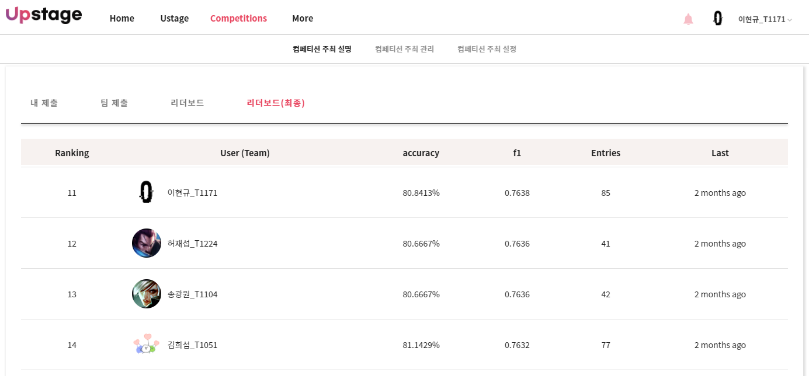

# 마스크 착용 상태 분류

### Tag
PStage | Boostcamp

___

## 성과

### 최종 순위 11위 달성  
(이미지는 서버 정상화 후 갱신하겠습니다.)  
 ([link](http://boostcamp.stages.ai/competitions/1/leaderboard))  

### 각종 토론 글 작성
 ([link](http://boostcamp.stages.ai/competitions/1/discussion?sort=4&page=1))  

___

## 대회 개요

### 전체 개요 설명
COVID-19의 확산으로 우리나라는 물론 전 세계 사람들은 경제적, 생산적인 활동에 많은 제약을 가지게 되었습니다. 우리나라는 COVID-19 확산 방지를 위해 사회적 거리 두기를 단계적으로 시행하는 등의 많은 노력을 하고 있습니다. 과거 높은 사망률을 가진 사스(SARS)나 에볼라(Ebola)와는 달리 COVID-19의 치사율은 오히려 비교적 낮은 편에 속합니다. 그럼에도 불구하고, 이렇게 오랜 기간 동안 우리를 괴롭히고 있는 근본적인 이유는 바로 COVID-19의 강력한 전염력 때문입니다.

감염자의 입, 호흡기로부터 나오는 비말, 침 등으로 인해 다른 사람에게 쉽게 전파가 될 수 있기 때문에 감염 확산 방지를 위해 무엇보다 중요한 것은 모든 사람이 마스크로 코와 입을 가려서 혹시 모를 감염자로부터의 전파 경로를 원천 차단하는 것입니다. 이를 위해 공공 장소에 있는 사람들은 반드시 마스크를 착용해야 할 필요가 있으며, 무엇 보다도 코와 입을 완전히 가릴 수 있도록 올바르게 착용하는 것이 중요합니다. 하지만 넓은 공공장소에서 모든 사람들의 올바른 마스크 착용 상태를 검사하기 위해서는 추가적인 인적자원이 필요할 것입니다.

따라서, 우리는 카메라로 비춰진 사람 얼굴 이미지 만으로 이 사람이 마스크를 쓰고 있는지, 쓰지 않았는지, 정확히 쓴 것이 맞는지 자동으로 가려낼 수 있는 시스템이 필요합니다. 이 시스템이 공공장소 입구에 갖춰져 있다면 적은 인적자원으로도 충분히 검사가 가능할 것입니다.  
([link](http://boostcamp.stages.ai/competitions/1/overview/description))  

### 평가 방법
Submission 파일에 대한 평가는 F1 Score를 통해 진행합니다.  
([link](http://boostcamp.stages.ai/competitions/1/overview/description))  

___

## 대회 참여

### 참여 일정
| 일시 | 내용 | Score |  
|:--:|:--:|:--:|
|21.03.29 ~ 31| 학습 Data 구축 및 Baseline 설계 | 약 55% |
|21.04.1 ~ 2| Data Filtering, Croping 등 실험 | 약 63% |
|21.04.3 ~ 4| Loss Function, Optimizer, Scheduling 등 실험 | 약 72% |
|21.04.5 ~ 6| Backbone Size, Multi-loss, Data Cleansing 등 실험 | 약 73% |
|21.04.7 ~ 8| Model Custonmizing, Dropout 등 실험 | 약 78% |

### 참여 내용 (상세)
Wrap-up Report에 자세히 작성했습니다. 
([link](https://github.com/bcaitech1/p1-img-LeeHyeonKyu/blob/main/etc/wrap_up_report.pdf))  
